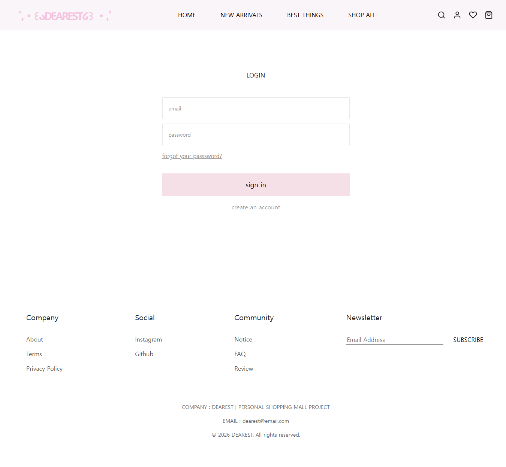
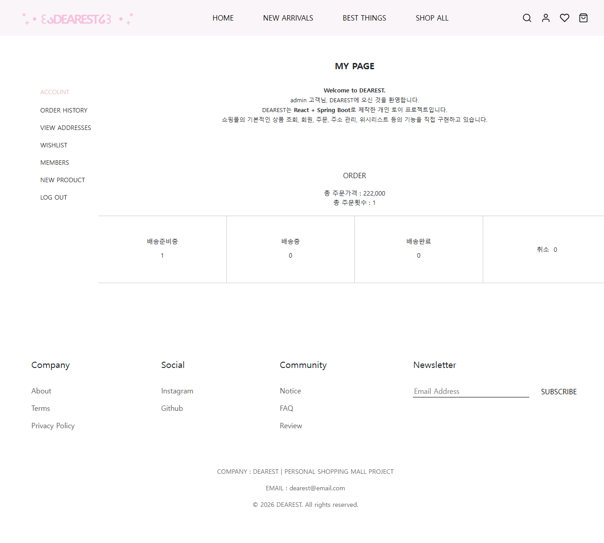

# DEARESTSHOP

Spring Boot 기반 온라인 쇼핑몰 백엔드 프로젝트

## 프로젝트 소개

DEARESTSHOP은 온라인 쇼핑몰의 주요 기능을 구현한 프로젝트입니다.

회원 관리부터 상품, 장바구니, 위시리스트, 주문, 배송지 관리까지
쇼핑몰의 기본적인 구매 흐름을 Spring Boot 기반으로 구현했습니다.

또한 Spring Security와 JWT를 이용한 인증/인가를 적용하고,
QueryDSL을 이용하여 상품 검색, 카테고리 필터링 및 정렬 기능을 구현했습니다.

---

## 기술 스택

### Backend

- Java 21
- Spring Boot
- Spring Data JPA
- QueryDSL
- Spring Security
- JWT
- H2 Database

### Test

- JUnit 5
- Spring Boot Test

### Frontend

- React
- Vite
- React Router
- Axios
- Bootstrap
- React Icons

---

## 주요 기능

### 회원

- 회원가입
- 로그인
- 비밀번호 암호화
- JWT 기반 인증
- 회원 조회

### 상품

- 상품 등록
- 상품 조회
- 상품 상세 조회
- 상품 이미지 등록
- 카테고리 조회
- 상품 검색
- 카테고리 필터링
- 최신순 정렬
- 판매량순 정렬

### 장바구니

- 장바구니 상품 추가
- 장바구니 수량 변경
- 장바구니 상품 삭제
- 장바구니 조회

### 위시리스트

- 상품 찜하기
- 찜한 상품 조회
- 찜 취소

### 주문

- 주문 생성
- 주문 조회
- 주문 상세 조회
- 주문 완료
- 주문 취소
- 주문 생성 시 재고 감소
- 주문 생성 시 판매량 증가
- 주문 취소 시 재고 복구
- 주문 취소 시 판매량 복구

### 배송지

- 배송지 등록
- 배송지 조회
- 배송지 수정
- 배송지 삭제
- 기본 배송지 설정

### 관리자

- 회원 관리
- 상품 등록

---

## 인증

Spring Security와 JWT를 이용하여 로그인 인증을 구현했습니다.

로그인 성공 시 JWT를 발급하고,
이후 요청에서 JWT를 이용하여 로그인 회원을 확인합니다.

---

## 상품 검색

QueryDSL을 이용하여 상품 검색 기능을 구현했습니다.

- 상품명 검색
- 카테고리 필터링
- 최신순 정렬
- 판매량순 정렬

검색 조건에 따라 동적으로 쿼리를 구성하도록 구현했습니다.

---

## 주문 처리

주문 생성 시 주문 상품의 판매량을 증가시키고 재고를 감소시킵니다.

주문 취소 시에는 반대로 재고를 복구하고 판매량을 감소시킵니다.

```
주문 생성
    ↓
판매량 증가
    ↓
재고 감소

주문 취소
    ↓
판매량 감소
    ↓
재고 복구
```

---

## 테스트

Integration 테스트

@SpringBootTest를 이용하여 실제 Spring Context를 구성하고,
테스트용 H2 데이터베이스를 사용하여 여러 계층이 함께 동작하는지 테스트했습니다.

회원 통합 테스트
상품 통합 테스트
주문 통합 테스트

## 프로젝트 구조

```text
dearestshop
├── src
│   ├── main
│   │   ├── java
│   │   │   └── dearest
│   │   │       └── dearestshop
│   │   │           ├── api
│   │   │           ├── config
│   │   │           ├── controller
│   │   │           ├── domain
│   │   │           ├── dto
│   │   │           ├── jwt
│   │   │           ├── repository
│   │   │           └── service
│   │   │
│   │   └── resources
│   │       └── application.yml
│   │
│   └── test
│       ├── java
│       │   └── dearest
│       │       └── dearestshop
│       │           └── ...
│       └── resources
│           └── application.yml
│
├── docs
│   └── erd.png
│
├── build.gradle
├── settings.gradle
└── README.md
```

## ERD


## API 


## 화면

### 회원
- 로그인
  
- 회원가입

### 상품
- 상품 목록
  
- 상품 상세
  

### 구매
- 장바구니
  
- 주문
  

### 마이페이지
- 마이페이지
  
- 주문 내역
  
- 배송지 관리
- 위시리스트

### 관리자
- 회원 관리
- 상품 등록
  

## 트러블슈팅 

JWT 인증 및 403 오류

Spring Security와 JWT 인증 과정에서 발생한 인증 문제를 해결했습니다.

상품 이미지 404 오류

상품 이미지 파일 경로와 Spring의 정적 리소스 매핑을 확인하여
이미지 조회 문제를 해결했습니다.

주문 취소 시 재고 처리

주문 생성 시 재고를 감소시키고,
주문 취소 시 재고를 다시 증가시키도록 비즈니스 로직을 구현했습니다.

테스트 환경 분리

개발 환경과 테스트 환경의 데이터베이스 설정을 분리하여
통합 테스트에서 별도의 H2 데이터베이스를 사용하도록 구성했습니

## 실행 방법 

## 배포

현재 별도의 서버 배포는 진행하지 않았으며,
로컬 개발 환경에서 Backend와 Frontend를 연동하여 구현 및 테스트했습니다.

