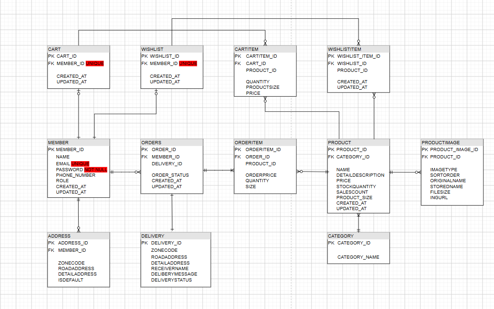
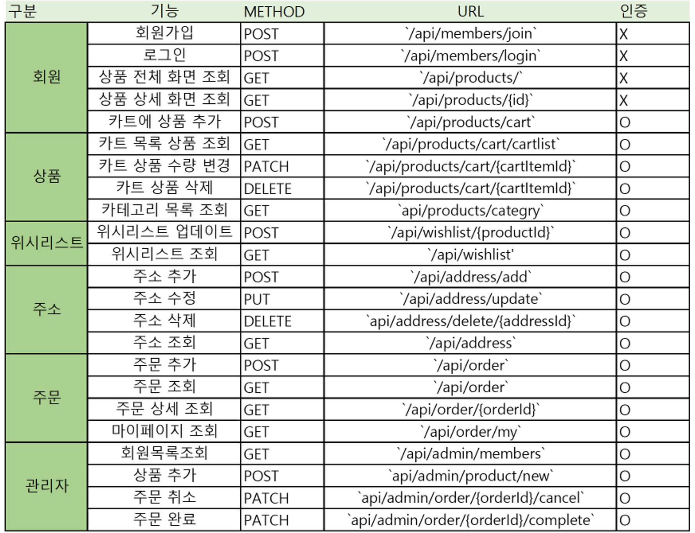
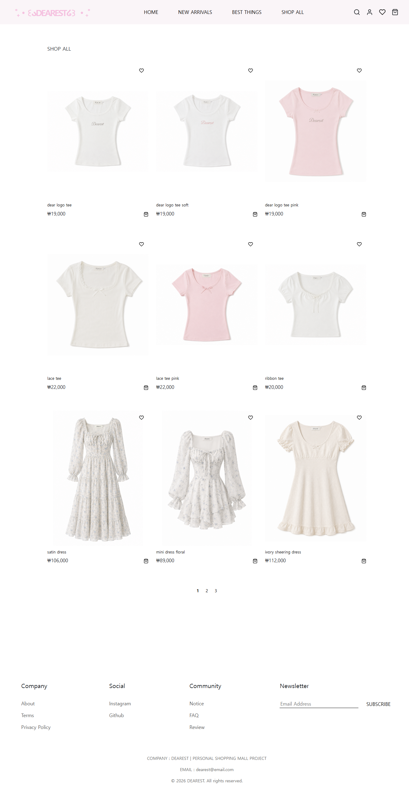
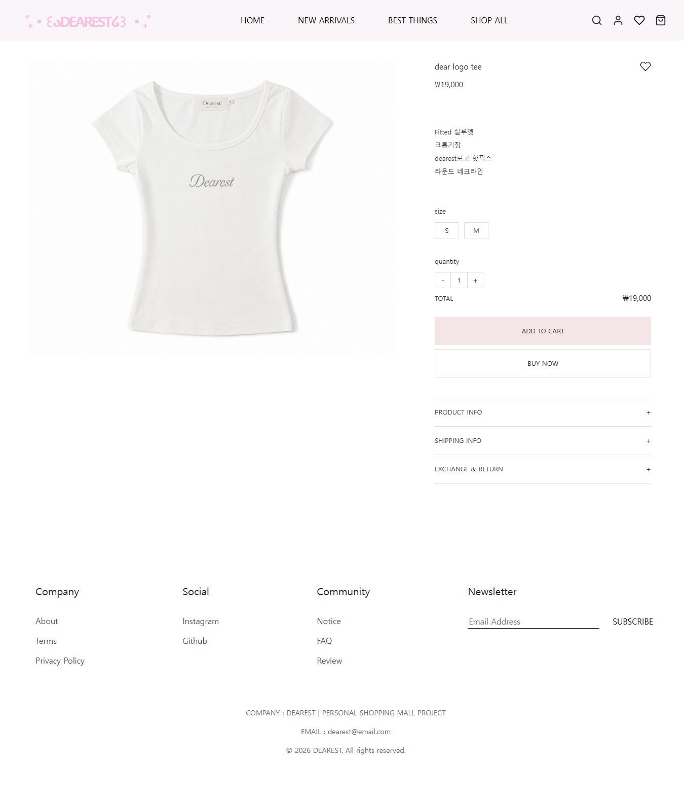
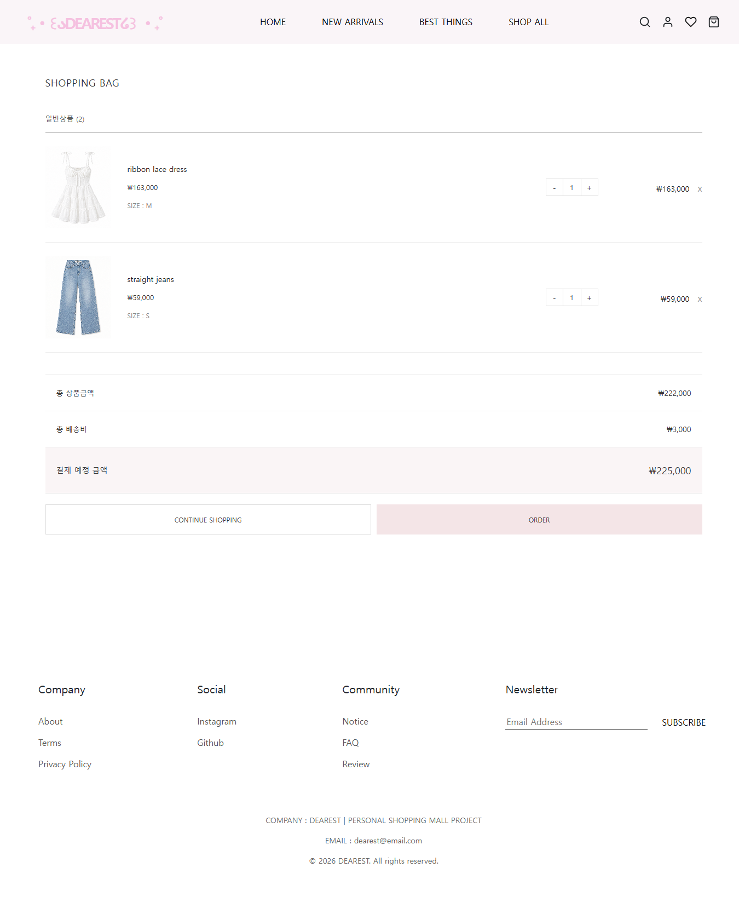
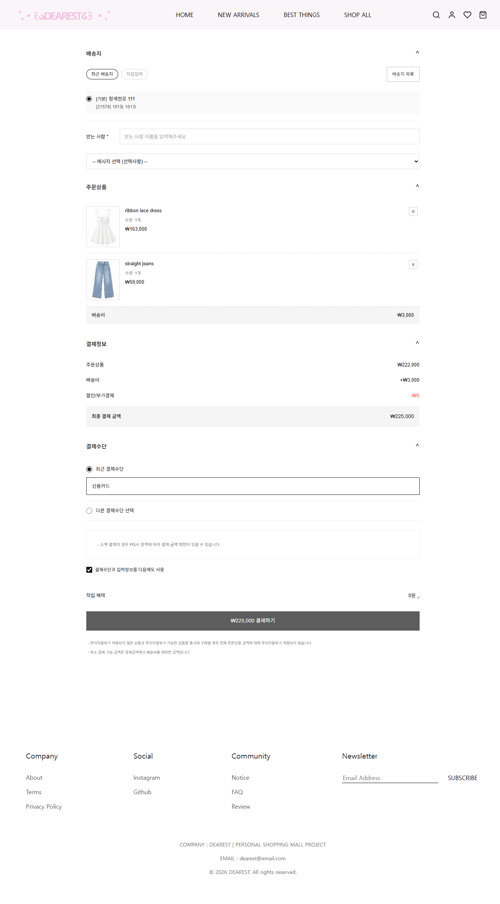
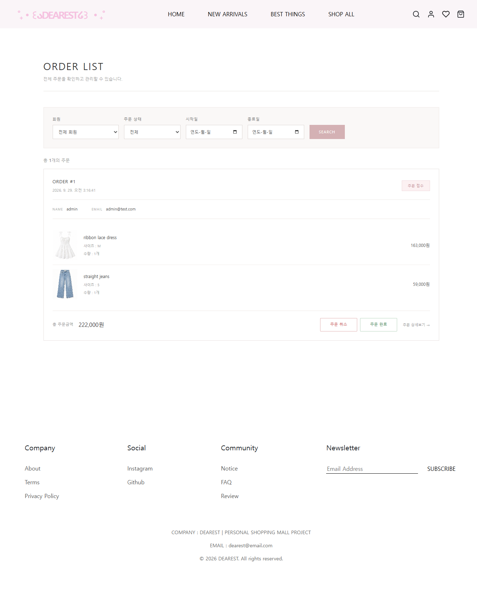
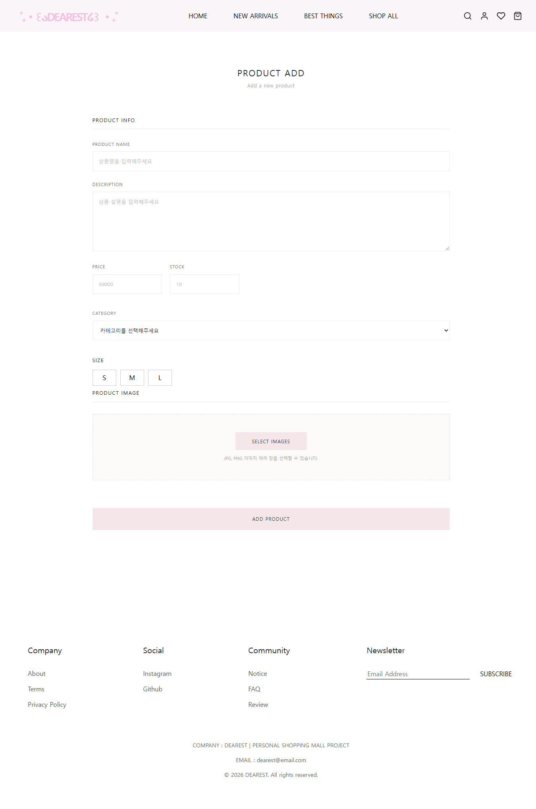

# DEARESTSHOP

Spring Boot와 React를 기반으로 구현한 온라인 쇼핑몰 프로젝트

<p align="center">
  <a href="https://dearestshop-react.vercel.app">
    
  </a>
</p>

## 🔗 배포 사이트

- **Frontend:** https://dearestshop-react.vercel.app
- **Backend API:** https://dearestshop-api.onrender.com

> 배포된 웹사이트에서 회원가입, 로그인, 상품 조회, 검색, 장바구니, 위시리스트, 배송지 관리, 주문 및 관리자 기능을 확인할 수 있습니다.

## 프로젝트 소개

DEARESTSHOP은 Spring Boot와 React를 기반으로 구현한 온라인 쇼핑몰 프로젝트입니다.

회원가입과 로그인부터 상품 조회, 검색, 장바구니, 위시리스트,
배송지 관리, 주문 및 주문 취소까지 실제 쇼핑몰의 기본적인 구매 흐름을 구현했습니다.

Backend에서는 Spring Data JPA를 이용하여 엔티티와 데이터베이스를 관리하고,
Spring Security와 JWT를 이용하여 로그인 인증 및 권한 관리를 구현했습니다.

또한 QueryDSL을 활용하여 상품명 검색, 카테고리 필터링,
최신순 및 판매량순 정렬과 같은 동적 검색 기능을 구현했습니다.

Frontend에서는 React를 이용하여 상품 조회부터 주문까지의
사용자 화면과 관리자 기능을 구현했습니다.

Frontend는 Vercel, Backend는 Render를 이용하여 실제 웹 환경에 배포했습니다.

---

## 기술 스택

### Backend

- Java 21
- Spring Boot
- Spring Data JPA
- QueryDSL
- Spring Security
- JWT
- H2 Database

### Test

- JUnit 5
- Spring Boot Test

### Frontend

- React
- Vite
- React Router
- Axios
- Bootstrap
- React Icons

- ### Deployment

- Vercel
- Render
- Docker

---

## 주요 기능

### 회원

- 회원가입
- 로그인
- 비밀번호 암호화
- JWT 기반 인증
- 회원 조회

### 상품

- 상품 등록
- 상품 조회
- 상품 상세 조회
- 상품 이미지 등록
- 카테고리 조회
- 상품 검색
- 카테고리 필터링
- 최신순 정렬
- 판매량순 정렬

### 장바구니

- 장바구니 상품 추가
- 장바구니 수량 변경
- 장바구니 상품 삭제
- 장바구니 조회

### 위시리스트

- 상품 찜하기
- 찜한 상품 조회
- 찜 취소

### 주문

- 주문 생성
- 주문 조회
- 주문 상세 조회
- 주문 완료
- 주문 취소
- 주문 생성 시 재고 감소
- 주문 생성 시 판매량 증가
- 주문 취소 시 재고 복구
- 주문 취소 시 판매량 복구

### 배송지

- 배송지 등록
- 배송지 조회
- 배송지 수정
- 배송지 삭제
- 기본 배송지 설정

### 관리자

- 회원 관리
- 상품 등록

---

## 인증

Spring Security와 JWT를 이용하여 로그인 인증 및 권한 관리를 구현했습니다.

로그인 성공 시 JWT를 발급하고, 클라이언트에서는 발급받은 JWT를 저장한 후 이후 API 요청의 Authorization 헤더에 포함하여 서버로 전달합니다.

서버에서는 JWT를 검증하여 로그인한 회원을 확인하고,
회원의 권한에 따라 접근 가능한 기능을 구분했습니다.

- JWT 기반 로그인 인증
- Authorization 헤더를 통한 JWT 전달
- JWT 검증을 통한 사용자 인증
- USER / ADMIN 권한 구분
- 관리자 API 접근 권한 제한

---

## 상품 검색

QueryDSL을 이용하여 검색 조건에 따라 동적으로 쿼리를 구성했습니다.

- 상품명 검색
- 카테고리 필터링
- 최신순 정렬
- 판매량순 정렬

검색어, 카테고리, 정렬 조건을 조합하여
사용자가 원하는 상품을 조회할 수 있도록 구현했습니다.

---

## 주문 처리

주문 생성과 취소 과정에서 상품의 재고와 판매량을 함께 관리하도록 구현했습니다.


```
주문 생성
    ↓
판매량 증가
    ↓
재고 감소
```

주문 취소 시 기존 주문 상품의 수량을 기준으로
재고와 판매량을 원래 상태로 복구하도록 구현했습니다.

```
주문 취소
    ↓
판매량 감소
    ↓
재고 복구
```

---

## 테스트

`@SpringBootTest`를 이용하여 실제 Spring Context를 구성하고,
테스트용 H2 데이터베이스를 사용하여 여러 계층이 함께 동작하는지 검증했습니다.

주요 통합 테스트:

- 회원 통합 테스트
  - 회원가입
  - 로그인
  - 비밀번호 암호화
  - 회원 조회
  - JWT 발급

- 상품 통합 테스트
  - 상품 등록
  - 상품 조회
  - 상품 검색
  - 카테고리 조회
  - 상품 목록 조회

- 주문 통합 테스트
  - 주문 생성
  - 기존 배송지 및 새 배송지 처리
  - 주문 목록 조회
  - 주문 상세 조회
  - 마이페이지 주문 조회
  - 주문 완료
  - 주문 취소
  - 주문 취소 시 재고 및 판매량 복구
  - 주문 상태에 따른 예외 처리
  - 주문 완료 후 장바구니 상품 삭제

## 프로젝트 구조

```text
dearestshop
├── src
│   ├── main
│   │   ├── java
│   │   │   └── dearest
│   │   │       └── dearestshop
│   │   │           ├── api
│   │   │           ├── config
│   │   │           ├── controller
│   │   │           ├── domain
│   │   │           ├── dto
│   │   │           ├── jwt
│   │   │           ├── repository
│   │   │           └── service
│   │   │
│   │   └── resources
│   │       └── application.yml
│   │
│   └── test
│       ├── java
│       │   └── dearest
│       │       └── dearestshop
│       │           └── ...
│       └── resources
│           └── application.yml
│
├── docs
│   └── erd.png
│
├── build.gradle
├── settings.gradle
└── README.md
```

## ERD


## API 


## 프로젝트 시연 영상
Spring Boot와 React를 이용하여 구현한 DEARESTSHOP의
주요 기능을 확인할 수 있습니다.

[


## 화면

### 회원
- 로그인
- 회원가입

### 상품
- 상품 목록
 
- 상품 상세


### 구매
- 장바구니

- 주문


### 마이페이지
- 마이페이지
- 주문 내역

- 배송지 관리
- 위시리스트

### 관리자
- 회원 관리
- 상품 등록


## 트러블슈팅 

### 1. JWT 인증 과정에서 403 오류 발생

**문제**
상품 등록 요청 시 403 Forbidden 오류가 발생했습니다.

**원인**
JWT 토큰 만료로 인해 인증되지 않은 요청으로 처리되었습니다.

**해결**
재로그인 후 새로운 JWT를 발급받고 Authorization 헤더가 전달되는지 확인했습니다.

---

### 2. 상품 등록 시 Category ID가 전달되지 않는 문제

**문제**
상품 등록 요청에서 Category ID가 null로 전달되었습니다.

**원인**
프론트엔드의 `categoryId`와 DTO 필드명이 일치하지 않았습니다.

**해결**
프론트엔드 요청 데이터와 DTO 필드명을 동일하게 수정하였습니다.

---

### 3. 테스트 데이터 생성 시 Category 중복 오류

**문제**
테스트 실행 시 Category의 unique constraint 오류가 발생했습니다.

**원인**
테스트마다 동일한 `TOPS` 카테고리를 생성했습니다.

**해결**
테스트 데이터 생성 방식을 수정하여 중복 데이터가 생성되지 않도록 처리하였습니다.

---

### 4. 주문 취소 시 상품 재고 복구

**문제**
주문 취소 후 상품 재고가 원래 수량으로 복구되지 않았습니다.

**원인**
주문 생성 시 재고를 감소시키는 로직은 있었지만,
주문 취소 시 재고를 증가시키는 로직이 없었습니다.

**해결**
주문 취소 시 주문 수량만큼 재고를 복구하고 판매량을 감소시키도록 수정했습니다.

---

### 5. 상품 목록 조회 시 N+1 문제 발생

**문제**

상품 목록 조회 시 상품마다 연관된 이미지를 조회하면서
불필요한 추가 쿼리가 발생했습니다.

상품이 21개인 경우 상품 조회 쿼리 외에
각 상품의 이미지를 조회하기 위한 쿼리가 반복적으로 실행되어
N+1 문제가 발생했습니다.

**원인**

상품과 상품 이미지가 `@OneToMany` 연관관계로 구성되어 있었고,
상품 목록을 조회하면서 각 상품의 이미지를 개별적으로 조회하게 되었습니다.

**해결**

Hibernate의 `default_batch_fetch_size`를 설정하여
연관된 상품 이미지를 일정 개수씩 묶어서 조회하도록 수정했습니다.

```yaml
spring:
  jpa:
    properties:
      hibernate:
        default_batch_fetch_size: 100
```
이를 통해 상품별로 이미지를 각각 조회하는 대신
여러 상품의 연관 데이터를 한 번에 조회하도록 개선했습니다.

## 실행 방법

### 배포 환경

실제 서비스는 다음 환경에 배포되어 있습니다.

- Frontend: Vercel
- Backend: Render

### 로컬 환경

#### 1. Backend

H2 Database를 실행한 후 Spring Boot Backend를 실행합니다.

개발 환경에서는 H2 TCP Server와 H2 Database를 사용합니다.

```text
jdbc:h2:tcp://localhost/~/dearestshop
```

IntelliJ에서 Spring Boot 메인 클래스를 실행합니다.

```test
http://localhost:8080
```

Spring Boot 실행 시 초기 데이터가 자동으로 생성됩니다.

카테고리: TOPS, SKIRTS, PANTS, DRESSES
초기 상품: 총 21개
일반 회원 1명
관리자 회원 1명
관리자 기본 배송지 1개

#### 2. Frontend

React 프로젝트로 이동합니다.

```test
npm install
npm run dev
```

로컬 개발 서버 :
```test
http://localhost:5173
```

### 초기 테스트 계정

> 로컬 환경에서 기능 확인을 위한 테스트 계정입니다.

| 구분 | 이메일 | 비밀번호 |
|---|---|---|
| 일반 회원 | `123@test.com` | `123` |
| 관리자 | `admin@test.com` | `admin` |

### 3. Frontend 실행

React 프로젝트로 이동합니다.

```text
npm install
npm run dev
```

```text
http://localhost:5173
```

### 4. 웹사이트 접속

로그인 후 상품 조회, 검색, 장바구니,
위시리스트, 배송지 관리, 주문 및 관리자 기능을
직접 확인할 수 있습니다.

## 🚀 배포

Frontend와 Backend를 각각 분리하여 배포했습니다.

### Frontend

React 애플리케이션은 Vercel을 이용하여 배포했습니다.

- Vercel
- URL: https://dearestshop-react.vercel.app

### Backend

Spring Boot 애플리케이션은 Render를 이용하여 배포했습니다.

- Render
- Spring Boot API 서버
- Docker 기반 배포

Frontend에서는 환경변수를 통해 Backend API 서버의 주소를 관리하도록 구성하여 로컬 개발 환경과 배포 환경에서 동일한 코드를 사용할 수 있도록 구성했습니다.

```text
Local
React
 ↓
http://localhost:8080
 ↓
Spring Boot

Production
React (Vercel)
 ↓
Spring Boot API (Render)

